# Nibble

**English** · [Português](README.pt-BR.md)

A pixel art pet that lives in the band above your Claude Code prompt. It eats your edits, cheers when your tests pass, worries when your context fills up, and grows over weeks of use. Next to it, the band shows your session's context and usage limits at a glance.

<picture>
  <source media="(prefers-color-scheme: dark)" srcset="assets/band-dark.svg">
  
</picture>

## Features

- **A living pet above the prompt.** It bobs, blinks, chews, sleeps and celebrates. On the desktop app it's an animated SVG; in the terminal it's drawn with half-block pixel art.
- **It feeds on your work.** File edits and shell commands feed it, passing tests make it happy, errors and failing tests worry it.
- **A long evolution.** Egg → baby → adult → master (with a crown) → legend (pearly coat and sparkles) → endless stars. Tuned so heavy users keep reaching new milestones for months.
- **Session usage at a glance.** Context window fill, 5-hour limit and weekly limit, with reset times and the session start. Bars turn amber past 60% and red past 85%.
- **It warns you.** When context reaches 80% the pet asks for a `/compact`; when a usage limit reaches 90% it gets tired.
- **Your pet, your name.** Rename it with `/nibble-name`.
- **English and Portuguese.** Switch with `/nibble-lang`.
- **Never dies, never loses progress.** At worst it gets hungry and grumpy until you come back.

## Install

From this repository as a marketplace:

```
/plugin marketplace add Duhfx/nibble
/plugin install nibble@nibble
```

Or load a local clone for one session:

```bash
claude --plugin-dir /path/to/nibble
```

Requires a Claude Code version with mods (function hooks) support.

## Commands

| Command | What it does |
| --- | --- |
| `/nibble-name <name>` | Renames your pet (up to 16 characters). |
| `/nibble-lang en` · `/nibble-lang pt-BR` | Switches the band's language. |

## How the pet works

All meters go from 0 to 100. Only actions taken inside Claude Code count.

### ♥ Mood
- **+12** when a test passes, **−8** when a test fails. A test is a shell command containing `test`, `pytest`, `jest`, `vitest`, `rspec` or `phpunit`.
- **+2** for every prompt you send.
- **−3** when any other tool call fails.
- Every minute it drifts 1 point back toward 50.

### 🍗 Food (full = well fed)
- **+4** per successful file edit (Edit, Write, MultiEdit, NotebookEdit).
- **+2** per successful shell command.
- **−1** per minute while Claude Code is open; **−1 per 10 minutes** while it's closed.
- The egg doesn't get hungry. Reading and searching don't feed it.

### ⚡ Energy
- **−0.5** per tool call and **−1** per minute while you're active.
- **+4** per minute after 5 minutes without activity.
- Fully restored after 30 minutes or more away.

### ✨ XP
- **+3** per passing test, **+1** per file edit, **+1** per other shell command. Failing tests give nothing.
- XP never goes down. The level is the square root of your XP.

<p align="center"></p>

| Stage | XP |
| --- | --- |
| 🥚 Egg | 0 |
| 🟢 Baby | 15 |
| 🟣 Adult | 150 |
| 👑 Master | 3,000 |
| 🌟 Legend | 20,000 |
| ★ Star | every 5,000 after Legend |

At around 500 tool calls a day: adult on day one, master in about a week, legend in about six weeks, then a star every ten days or so.

### Mood face
The first rule that applies wins:

1. **A short reaction** for a few seconds: eating after an edit, celebrating a passing test or a new stage, worried after an error.
2. **Asleep** when energy is below 15 or after 10 minutes without activity.
3. **Worried about the session** when context is at 80% or more, or a usage limit is at 90% or more.
4. **Hungry** when food is below 25.
5. **Sad** when mood is below 25.
6. **Happy** when mood is above 75.
7. **Chilling** otherwise.

## What the hooks do

Nibble is a mod: a module of function hooks (`hooks/register.tsx`). Each hook passes the event on unchanged; none blocks, rewrites or delays anything you or Claude do.

| Hook | What it does |
| --- | --- |
| `session.start` | Loads your pet from the plugin store, applies the time you were away, registers `/nibble-name` and `/nibble-lang`, and starts two timers: the animation frame (every 400 ms) and the minute tick (hunger, energy, mood drift, usage refresh). |
| `prompt.submit` | Adds a little mood and marks you as active. The prompt text is not read or changed. |
| `tool.call` | Lets the tool run, then looks at its name and whether it succeeded (and, for shell commands, the command text to spot tests) to update food, mood, energy and XP. The call and its result are passed on untouched. |
| `turn.complete` | Refreshes the context and usage-limit figures, the same ones the status line shows. |
| `command.run` | Answers `/nibble-name` and `/nibble-lang`. |
| `ui.render` (`AbovePrompt`) | Draws the band above the prompt. It steps aside while a survey uses the band. |

## Privacy

Nibble runs locally. It only looks at which tool ran and whether it succeeded (plus the shell command text, to spot tests). Its state lives in Claude Code's plugin store on your machine. Nothing is sent anywhere.

## Development

The plugin is a hooks module (`hooks/register.tsx`) with the sprites in `hooks/sprites.ts`, the desktop panels in `hooks/band.ts` and all texts in `hooks/i18n.ts`. Check it with:

```bash
claude plugin validate .
```
